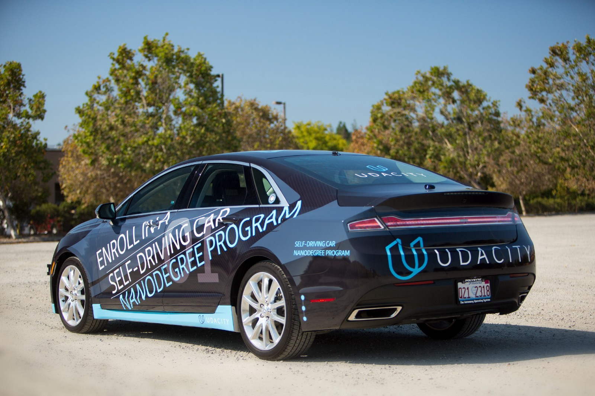

## Self-Driving Car - Integrated System

Each humankind has a love in his life, and here it is my love! Carla.

It is my honor that finally, I have done an amazing course after 6 incredible months in the [Udacity](https://www.udacity.com/). In this project, I have implemented an integrated system that based on that a car is going to detect traffic light, keeps in the road, and tries to control his steering and speed.

